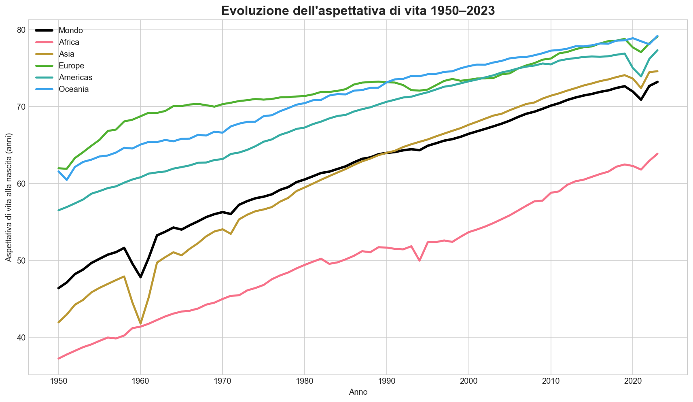
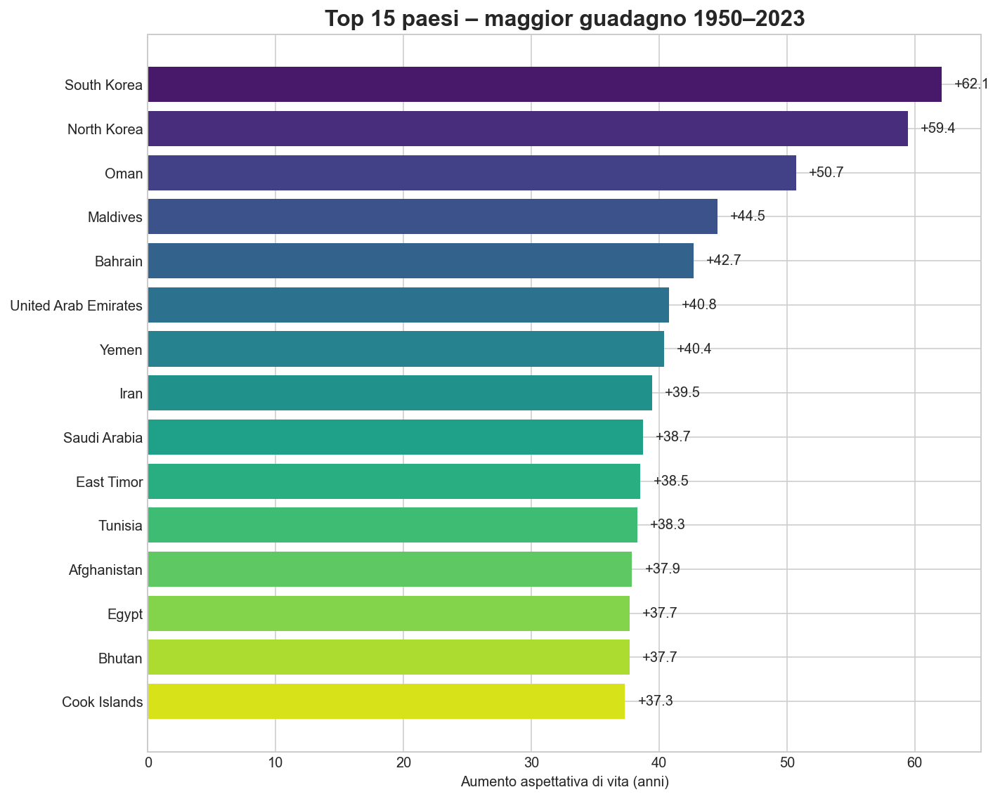
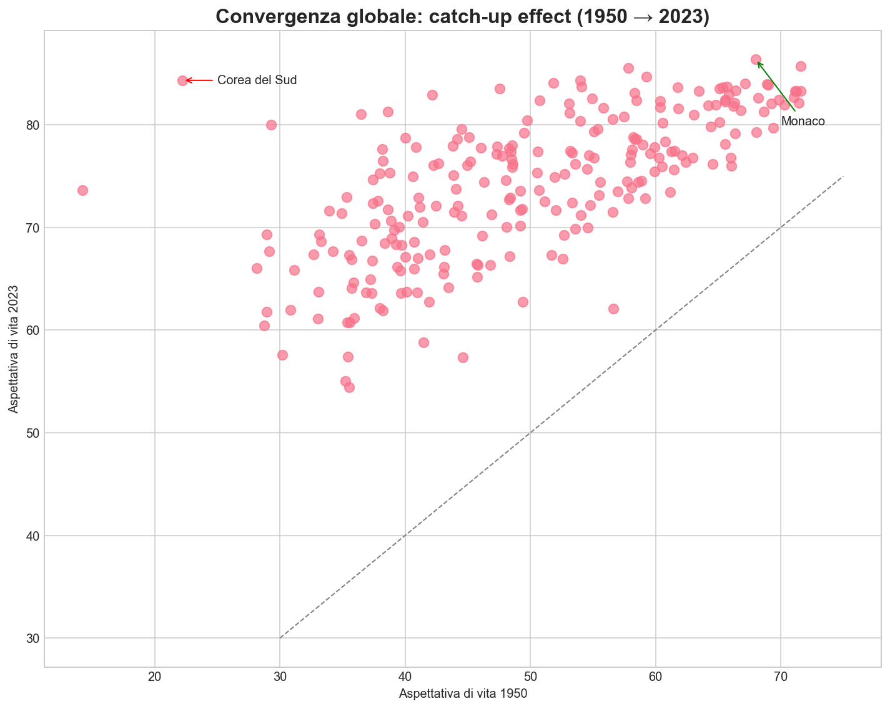
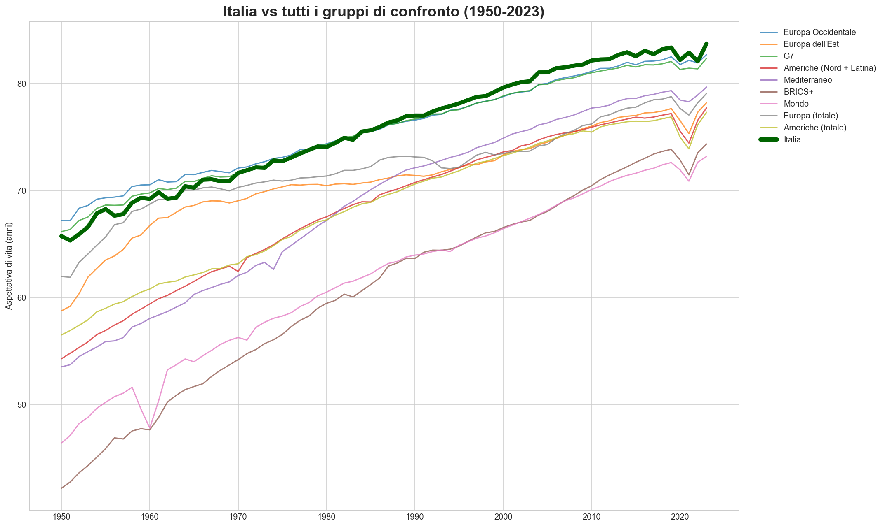

# Results – Global Life Expectancy Analysis (1950–2023)

This folder contains all the outputs of the complete analysis performed in `src/main.py`.

## Key Visualizations

### 1. Global Evolution (1950–2023)
  
*World life expectancy rose from 46.4 years in 1950 to 73.2 years in 2023 — the greatest health improvement in human history.*

### 2. The Great Chinese Famine (1959–1961) & Covid19 (2020-2021)– The only events that lowered global life expectancy
  
The only two events since 1950 that caused a decline in global life expectancy for consecutive years are:  
- the **Great Leap Forward famine in China (1959–1961)**, which lowered world life expectancy by ~4 years in just two years (30–45 million deaths), and  
- the **COVID-19 pandemic (2019–2021)**, which caused a smaller but still unprecedented drop of ~1.3 years — fully recovered by 2023.

### 3. Top 15 Countries – Biggest Gains (1950 → 2023)
  
**South Korea** leads with an astonishing **+62 years**, followed by other East Asian and Gulf countries. This is the most dramatic catch-up in history.

### 4. Global Convergence – The Catch-Up Effect
  
Countries that started with low life expectancy in 1950 gained the most → strong evidence of global convergence in health outcomes.

### 5. Sub-Saharan Africa vs Rest of the World
  
Clear setback between 1990–2005 due to the HIV/AIDS epidemic. Recovery began after 2005 thanks to antiretroviral therapy and global health programs.

### 6. Italy in International Context – Main Comparison
  
Italy consistently ranks among the world leaders, outperforming the G7 average and far ahead of Eastern Europe and emerging countries.

### 7. Italy vs Western Europe (Detail)
  
Italy has been in the top tier of Western Europe for decades, often 2nd or 3rd after Switzerland and Spain.

### 8. Italy vs All Comparison Groups (Comprehensive View)
  
Clear hierarchy:  
**Western Europe > G7 > Americas > Mediterranean > Eastern Europe > BRICS+ > World**

### 9. Global Distribution Over Time (Boxplot)
  
The world distribution has shifted upward and become much narrower → reduction in global health inequality.

## Summary Table – 1950 vs 2023

| Group / Country            | 1950 (years) | 2023 (years) | Gain (years) |
|----------------------------|--------------|--------------|--------------|
| World                      | 46.4         | 73.2         | **+26.8**    |
| Europe (total)             | 61.9         | 79.1         | +17.2        |
| Western Europe (avg)       | 66.8         | 82.9         | +16.1        |
| **Italy**                  | **63.7**     | **83.7**     | **+20.0**    |
| G7 (average)               | 67.9         | 81.3         | +13.4        |
| Americas (total)           | 56.5         | 77.3         | +20.8        |
| Eastern Europe (avg)       | ~58          | 75.5         | ~+17.5       |
| BRICS+ (avg)               | ~44          | ~73          | ~+29         |
| Sub-Saharan Africa (avg)   | 37.2         | 63.8         | +26.6        |

**Italy ranks in the global top 7–8 countries in 2023** (83.7 years).

## Main Conclusions

1. **The 20th–21st century saw the greatest improvement in human longevity ever recorded**  
2. **Developing countries caught up dramatically** — especially East Asia and the Gulf  
3. **The Great Chinese Famine (1959–1961)** is the only event that reversed global progress  
4. **HIV/AIDS caused a tragic but temporary setback** in sub-Saharan Africa  
5. **COVID-19 produced a small, short-lived global decline** — fully recovered by 2023  
6. **Italy is one of the world’s longevity champions**, consistently outperforming most high-income peers

Feel free to use these charts in reports, articles, or presentations (CC-BY license – please cite Our World in Data as the original source).

Analysis by *Salvatore Spagnuolo
